<div align="center">

# GovSense AI — Daily Intelligence Pipeline

**Automated government-data ingestion, deterministic analytics, risk analysis, ML anomaly detection, evidence generation, and AI explanation.**


<!--
PIPELINE STATUS BADGE — fill in OWNER/REPO to activate:


LICENSE BADGE — add only if a LICENSE file exists in the repository.
-->

</div>

---

GovSense AI continuously processes government MPLADS data, detects changes between source snapshots, updates affected analytical data, rebuilds the deterministic intelligence layer, generates evidence-backed AI explanations, and verifies the resulting production state.

> **Core invariant:** deterministic analytics are the authority. AI explains what has already been calculated and validated — it never produces, alters, or overrides a metric, score, rank, or label.

---

## 1 · The Pipeline at a Glance

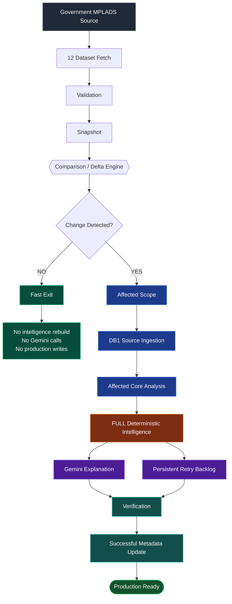

**Read the diagram this way:** every run pays for fetch, validation and comparison. Everything expensive downstream — ingestion, core analysis, the full intelligence rebuild, and Gemini — is gated behind a real, detected source change. A **no-change day follows the fast path and exits.**

---

## 3 · What the Daily Pipeline Actually Does

### Stage 1 — Source Fetch

The pipeline fetches the **12 government MPLADS datasets**. The dataset families are:

| Dataset family | Content |
|---|---|
| `allocated_limit` | Allocation limits per entity |
| `works_recommended` | Recommended works |
| `works_sanctioned` | Sanctioned works |
| `works_completed` | Completed works |
| `expenditure` | Expenditure records |
| `calamity` | Calamity-related records |

The fetch system addresses the relevant government dataset endpoints, and **MP and MLA work sources are kept separate** throughout — they are never merged into a single undifferentiated population at any stage of the pipeline.

Fetch behaviour:

- A **fresh HTTP session** is established for the fetch round.
- **Bounded concurrency** — the number of in-flight dataset requests is capped rather than unbounded.
- **Retry mechanism** with **backoff** between attempts.
- **Response validation** on each payload.
- **Empty-response detection** — an empty body is treated as a failure, not as an empty dataset.
- **Timestamp tracking** for each fetch round.
- **Snapshot storage** of the fetched payloads.

### Stage 2 — Validation

Raw responses are validated *before* they are allowed to become the current snapshot. This is the boundary that protects every downstream layer.

Validation prevents:

- empty datasets
- malformed downloads
- incomplete snapshots
- corrupt source state

> **A failed new snapshot must NOT replace the previous known-good snapshot.**

### Stage 3 — Snapshot Management

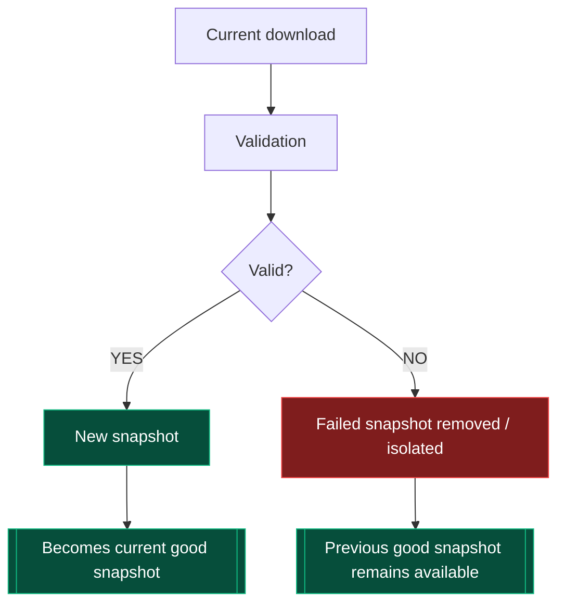

Promotion of a snapshot is an explicit, earned step — not a side effect of downloading.

### Stage 4 — Comparison / Delta Engine

The comparator reads the previous good snapshot alongside the current valid snapshot and identifies:

- appended records
- updated records
- unchanged records
- affected works
- affected members
- affected states
- changed datasets

This is what lets the system **avoid blindly rebuilding the raw source layer when nothing changed**.

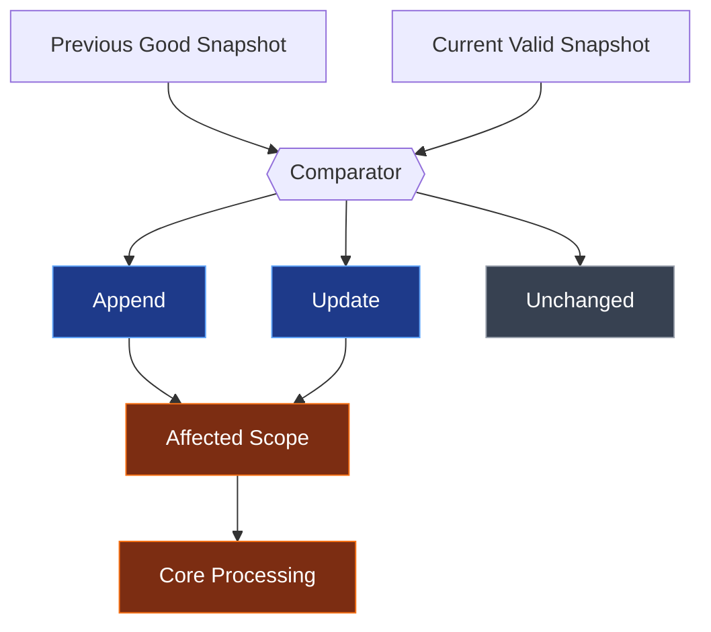

Where a source fingerprint / change-detection mechanism is implemented, it is used to short-circuit comparison work on datasets that are provably identical to the previous round.

---

## 4 · ⚡ Zero-Change Fast Path

Government source data may remain unchanged between daily runs. The pipeline is built for that to be the **normal, cheap case**.

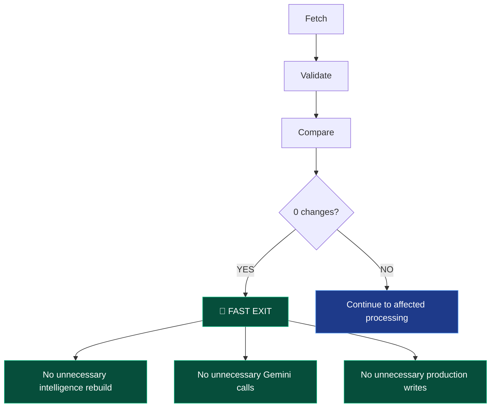

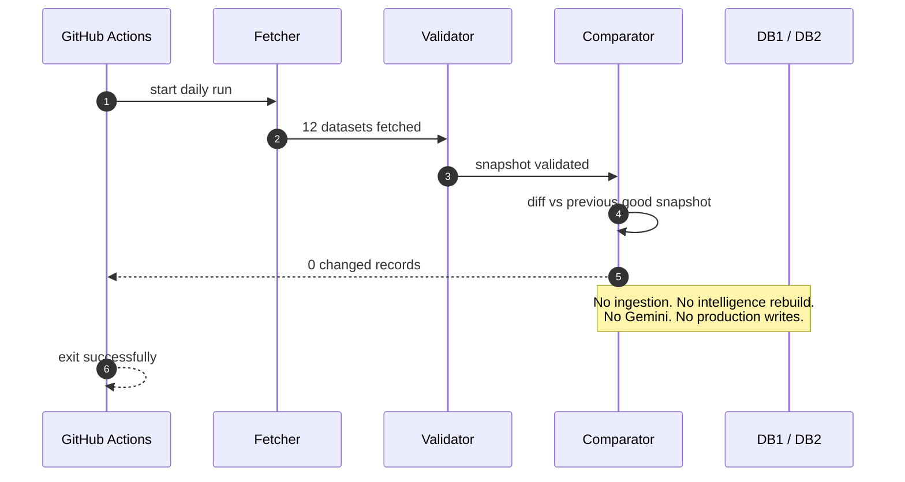

> **Why this matters:** the expensive part of the system is the full deterministic rebuild plus external AI calls. Gating both behind a real delta is what makes a daily schedule sustainable.

---

## 5 · Affected Core Processing

When a change *is* detected, the affected scope is used primarily for the **core source-derived processing**.

Affected scope carries concepts such as:

- affected work IDs
- affected member keys
- affected state IDs
- changed datasets


The core pipeline therefore **does not need to treat every source record as new every day**. Only the records the comparator implicated, and the entities they roll up into, are reprocessed at the core layer.

---

## 6 · 🔁 Full Deterministic Intelligence

> **GovSense AI intentionally performs a FULL deterministic intelligence recalculation on changed-data runs.**

This is a deliberate architectural decision, not a gap.

### Why full, and not affected-only

Several intelligence calculations have **global population dependencies** — their correct value for *any* entity depends on the state of *every* qualified entity:

| Calculation | Global dependency |
|---|---|
| **National ranking** | Requires the complete qualified population |
| **Percentile calculations** | Depend on the population distribution |
| **Peer ranking** | Depends on the peer population |
| **K-Means profiling** | Fitted across the population; cluster assignments can change |

A single changed member can shift ranks, percentiles and cluster membership for entities that did not themselves change. Rather than implementing a complicated mixture of partial and global recalculation modes — each with its own correctness edge cases — the production system performs the complete deterministic intelligence rebuild.

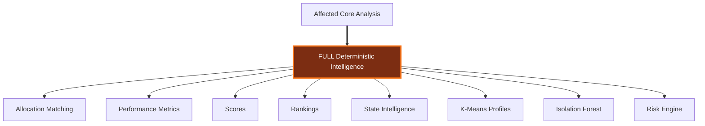

This is intentional. It favours:

- **deterministic results**
- **reproducibility**
- **mathematical consistency**
- **simpler operations**
- **easier verification**

The current runtime is acceptable for the production schedule.

---

## 7 · Performance Score

The production formula:

```text
performance_score =
      0.40 × completion_rate_pct
    + 0.40 × fund_utilization_pct
    + 0.20 × scale_score
```

### On `scale_score`

`scale_score` is a **percentile-based measure of total works**.

It is **not**:

- the raw number of works
- a direct bonus for having more projects

It provides a **normalised measure of operational scale**. Percentile/midrank handling is what prevents raw project volume from dominating the composite score — an entity with a very large portfolio cannot buy its way to a high score on volume alone, and ties are handled consistently rather than arbitrarily.

### Production classification

| Score | Label |
|------:|:------|
| ≥ 85 | `EXCEPTIONAL` |
| ≥ 70 | `PERFORMER` |
| ≥ 50 | `STABLE` |
| ≥ 35 | `NEEDS_ATTENTION` |
| < 35 | `UNDERPERFORMER` |

> **These labels are analytical classifications derived from completion, utilisation and scale metrics. They are not accusations, findings, or judgements about any individual.**

---

## 8 · Ranking System

Rankings are **separate from scores**. A score is an entity's own composite metric; a rank is that entity's position within a defined population.

- **Member national ranking** — MP and MLA populations are ranked **separately**.
- **Peer ranking** — performed within the defined peer population.
- **State ranking** — calculated separately for states.

All rankings are derived deterministically from validated metrics.

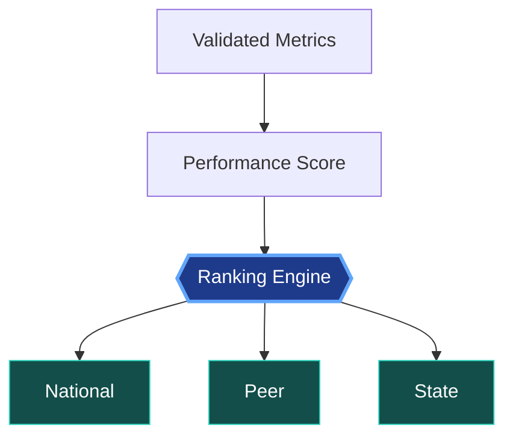

---

## 9 · ML / Intelligence Layers

| Layer | Purpose | Determines Score? |
|---|---|---|
| Deterministic analytics | Metrics and KPIs | **Yes** |
| Ranking engine | National / peer / state rank | **Yes** |
| K-Means | Operational profiling | No |
| Isolation Forest | Work-level anomaly detection | No |
| Risk engine | Risk signals | No performance override |
| Gemini | Explanation / evidence narrative | No |

**The separation is the point:**

- **K-Means** performs operational profiling. It does not override the score or the classification.
- **Isolation Forest** identifies unusual work-level patterns. It does not determine performance classification.
- **Risk** is a separate analytical dimension, carried alongside performance rather than folded into it.
- **Gemini** is an explanation layer over validated evidence. It cannot create or override deterministic metrics, scores, ranks, or labels.

---

## 10 · Risk Engine

Performance and risk are intentionally separate dimensions. A high-performing entity can carry risk signals; a low-performing one may carry none.

Risk uses signals such as:

- high-risk works
- overdue works
- flagged-rate signals
- anomaly level
- anomaly score

`completion_rate_pct` and `fund_utilization_pct` are **performance inputs** and are intentionally **not** used as direct risk inputs — otherwise the two dimensions would collapse into a restatement of each other.

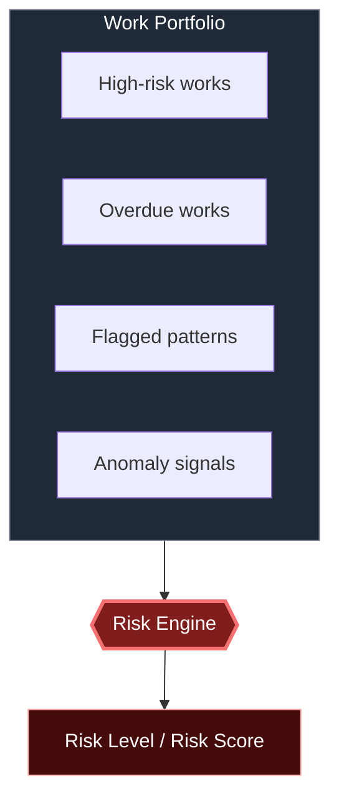

> A high risk level indicates **analytical attention required**. It does not indicate that a member or state has done anything wrong.

---

## 11 · Isolation Forest

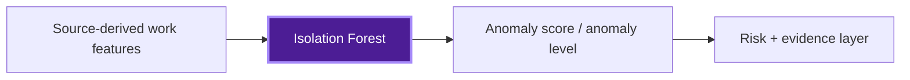

> ### **Anomaly ≠ wrongdoing.**

An anomaly score marks a **potentially unusual pattern** relative to the rest of the work population. It is an **analytical signal** meaning *this record requires attention* — a starting point for a human to look closer, not a conclusion.

---

## 12 · Evidence Pipeline

Evidence is generated from **validated analytical data** — never from model output, and never from unvalidated source rows.

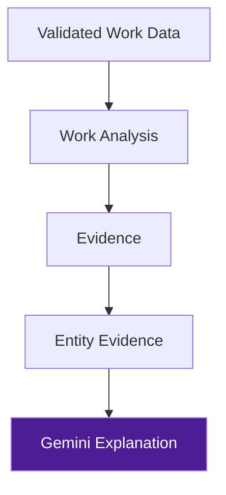

Evidence exists for four reasons:

- **Traceability** — every statement can be walked back to the records that produced it.
- **Explainability** — the reason behind a signal is stored, not inferred later.
- **Auditability** — the analytical layer can be independently checked.
- **Grounded AI responses** — Gemini writes from a fixed evidence payload rather than from open-ended prompting.

---

## 13 · Gemini Explanation Layer

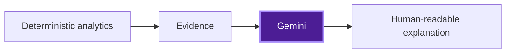

> **Gemini is not the source of truth.**

It does not calculate:

- scores
- ranks
- labels
- deterministic KPIs

It **explains already-validated results**.

### Failure handling

External API calls fail sometimes. When they do, the candidate is not dropped — it is carried forward.

```text
358 candidates
   ↓
356 successful   •   2 failed
   ↓
retry backlog
   ↓
future run
   ↓
latest evidence
   ↓
retry
```

The retry backlog is what prevents a temporary Gemini/API failure from permanently losing an explanation.

---

## 14 · Gemini Retry Backlog

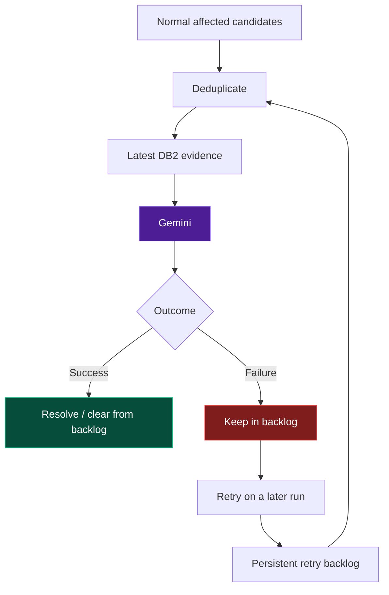

The important behaviour:

| Situation | Result |
|---|---|
| Item failed today, **unchanged** tomorrow | The backlog retries it. |
| Item failed today, **changed** tomorrow | It enters the normal affected set. Backlog entry and affected candidate are **deduplicated**, and the **latest evidence** is used. |

**This is what avoids stale AI explanations** — a retry never regenerates text against yesterday's evidence when today's evidence exists.

---

## 15 · 🛡️ Failure Safety

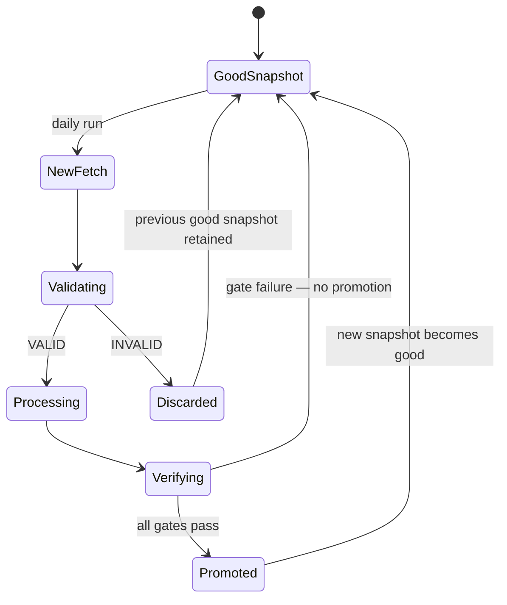

> **A failed run must never destroy the previous known-good source state.**

**Metadata update behaviour:** `data_updated` / successful-run metadata must only advance **after successful completion**. A run that fetched, processed, but failed verification does not get to claim success — the metadata stays where it was, and the next run sees an honest picture of the last good state.

---

## 16 · Retry and Fetch Resilience

The fetch layer is built for a source that is occasionally slow, occasionally flaky, and occasionally silent.

- **Bounded concurrency** — in-flight requests are capped.
- **Retries** on failed dataset requests.
- **Backoff** between retry attempts.
- **Fresh session/client per retry round**, where implemented, so a poisoned connection is not reused.
- **Fatal worker failure handling** — a worker dying does not silently produce a partial snapshot.
- **Captured error output** for diagnosis after the fact.
- **Exact failed-snapshot timestamp cleanup** — the failed artefact is cleaned up by its own timestamp, so cleanup can never touch a good snapshot.

---

## 17 · Database Architecture

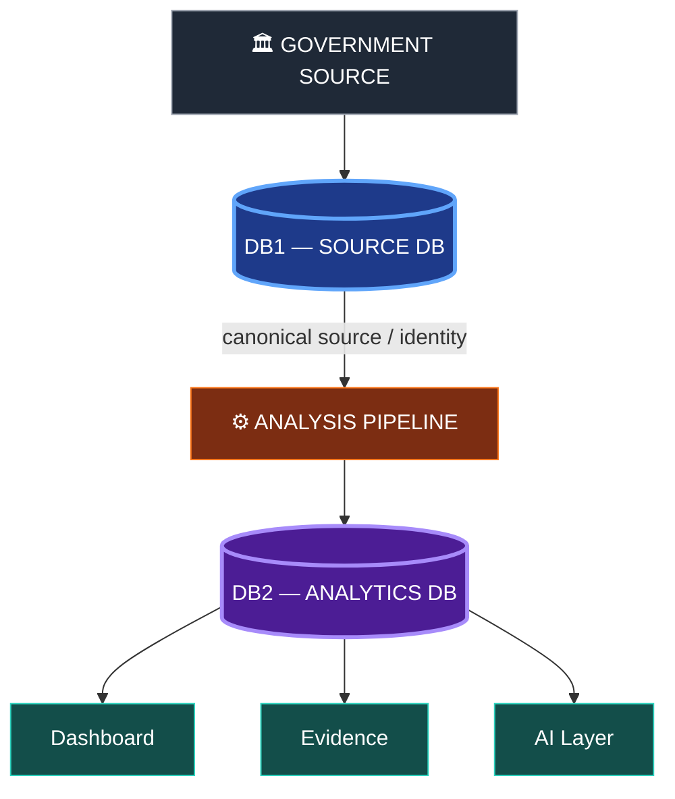

**DB1 holds:**
- authoritative government / source data
- member identities
- work source data
- operational metadata

**DB2 holds:**
- derived analytics
- intelligence
- evidence
- anomaly results
- risk
- AI analysis

> **No derived intelligence should be written into DB1.**

---

## 18 · Production DB2 Tables

Current canonical tables, grouped by purpose:

| Group | Tables |
|---|---|
| **Core analysis** | `work_analysis`, `mla_work_analysis`, `member_metrics`, `state_metrics` |
| **Intelligence** | `member_intelligence`, `state_intelligence` |
| **ML** | `ml_work_anomaly`, `model_registry` |
| **Evidence** | `entity_evidence`, `evidence_work_refs` |
| **AI** | `ai_analysis` |
| **Statistics / dashboard** | `national_statistics`, `overall_metrics`, `trends`, `category_metrics`, `fy_metrics` |
| **Operational** | `pipeline_metadata`, `evidence_pipeline_metadata` |

Historical archive tables, where any exist, are **not** active production intelligence tables and should not be treated as such.

---

## 19 · Backup Table Cleanup

Historical `*_backup_*` tables were removed from DB2 during final production cleanup.

**Current verified state:** `*_backup_*` tables = **0**

The current production codebase contains **no intended backup-table creation mechanism**, and the pipeline is expected to maintain zero such tables. Their reappearance is therefore itself a signal worth investigating.

---

## 20 · Daily GitHub Action

Workflow: **`.github/workflows/mplads-daily.yml`**

| Aspect | Behaviour |
|---|---|
| Trigger | Scheduled daily execution |
| Runtime | Python |
| Timeout | Job-level timeout configured |
| Concurrency | Concurrency protection prevents overlapping runs |
| Environment | Production environment |
| Credentials | Secret-based database connections |

### Schedule

```yaml
on:
  schedule:
    - cron: "30 18 * * *"   # UTC
```

**Timezone conversion:** `18:30 UTC` + `05:30` (IST offset) = **`00:00 IST`** — the run starts at midnight India time, giving the full Indian day to complete and be inspected.

---

## 21 · Daily Execution Timeline

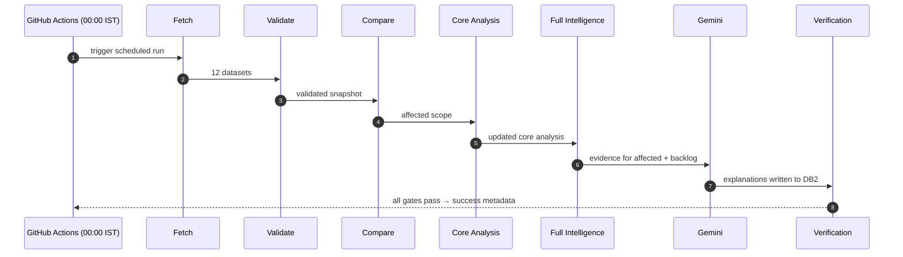

Actual runtime depends on whether changes exist and on the volume of affected processing; **no fixed runtime is promised**. For reference, current observed **full intelligence processing is approximately 15 minutes** in a changed-data production run. A zero-change run finishes far sooner via the fast path.

---

## 22 · Verification / Integrity Gates

Verification runs *before* the pipeline is allowed to declare success.

- canonical member population
- MP count
- MLA count
- state count
- synthetic ID detection
- duplicate detection
- null score checks
- score formula consistency
- ranking consistency
- date validity
- anomaly / risk integrity
- evidence integrity
- AI status
- database routing
- unexpected table detection

### Current expected canonical population

| Entity | Expected |
|---|---:|
| MPs | **543** |
| MLAs | **233** |
| Canonical members | **776** |
| States | **36** |

---

## 23 · Reproducibility

```text
same validated source state
        +
same deterministic algorithms
        ↓
same analytical outputs
```

The deterministic intelligence layer is designed so that a rebuild from the same validated snapshot produces the same metrics, scores and ranks. That property is what makes the analytical layer **auditable** — a third party can recompute and compare.

**AI/Gemini is treated separately** because it is probabilistic and external. Its output is not expected to be byte-identical between runs, which is precisely why it is confined to the explanation layer and kept out of every calculation that must be reproducible.

---

## 24 · Idempotency

Rerunning the intelligence/backfill process should not create duplicate canonical records.

> **Production writes use deterministic identities / upsert semantics where implemented.**

This is a statement about how writes are structured, not a claim of complete mathematical idempotency across every code path — the verification gates (duplicate detection, synthetic ID detection) exist partly to catch any case where that assumption is violated.

---

## 25 · Performance Philosophy

The pipeline is optimised **at the correct boundaries** — not uniformly, and not where optimisation would cost correctness.

| Condition | Strategy |
|---|---|
| No source change | **Fast exit** |
| Source changed | **Affected core processing** |
| Deterministic intelligence | **Full recalculation** |
| Gemini | **Affected + retry backlog** |

This is intentional, because it means:

- the deterministic layer remains **simple** — one code path, not a partial/global hybrid
- **ranking consistency** is preserved
- **K-Means consistency** is preserved
- global calculations remain **mathematically correct**
- external AI work remains **incremental**, where incrementality is cheap and safe

---

## 26 · Observed Final Health

| Component | Expected state |
|---|---|
| MPs | 543 |
| MLAs | 233 |
| Canonical members | 776 |
| States | 36 |
| Synthetic member IDs | 0 |
| Duplicate canonical members | 0 |
| DB2 backup tables | 0 |
| XGBoost | Removed |
| Intelligence destination | DB2 |
| Source / identity authority | DB1 |
| Intelligence strategy | Full on changed runs |
| Zero-change strategy | Fast path |

> This table describes the **verified current architecture and state**. It is not a guarantee that future government source data cannot change these populations — if the source changes, the verification gates are the mechanism that surfaces it.

---

## 27 · Repository Structure

Key pipeline paths:

```text
.github/
└── workflows/
    └── mplads-daily.yml

automation/
├── daily_pipeline.py
├── pipeline_controller.py
├── intelligence_backfill.py
└── intelligence/

analysis/
├── affected_scope.py
├── snapshot_loader.py
├── comparator_v2.py
└── intelligence/
```

---

## 28 · Security / Secrets

- Credentials are provided through **GitHub Secrets / environment variables**.
- **No database passwords are committed** to the repository.
- `.env` is **git-ignored**.
- Production DB connections use **secret configuration**.
- **Pooler endpoints** are used for GitHub Actions → PostgreSQL connectivity.

> No credentials, connection URLs containing credentials, API keys or tokens appear in this repository or in its documentation. If one is ever exposed, rotate it before anything else.

---

## 29 · Troubleshooting

<details>
<summary><b>Fetch failure</b></summary>

- Inspect the failing dataset, its key, and the HTTP response that was captured.
- Confirm whether retry behaviour ran and what each attempt returned.
- Confirm the failed snapshot was cleaned up by its exact timestamp, and that the previous good snapshot is still intact.
</details>

<details>
<summary><b>Database connection failure</b></summary>

- Verify the pooler URL is the one in use for GitHub Actions.
- Verify the GitHub Secrets are present and current in the production environment.
- Check database reachability independently of the workflow.
</details>

<details>
<summary><b>Gemini failure</b></summary>

- The candidate **remains retryable** — this is expected behaviour, not data loss.
- Inspect the retry backlog to confirm the item is queued.
- **Do not invalidate deterministic intelligence** because of an AI-layer failure. The two are independent by design.
</details>

<details>
<summary><b>Verification failure</b></summary>

- **Do not mark metadata successful.**
- Inspect which integrity gate failed and what value it observed versus expected.
- Preserve the previous known-good state where applicable, and resolve the gate before allowing promotion.
</details>

---

## 30 · Architectural Principles

> **1.** Source truth before intelligence
> **2.** Validate before promote
> **3.** Delta before expensive processing
> **4.** Deterministic analytics before AI explanation
> **5.** Full deterministic rebuild on changed runs
> **6.** Global calculations remain globally consistent
> **7.** AI never overrides deterministic truth
> **8.** Risk is separate from performance
> **9.** Failed snapshots never replace good snapshots
> **10.** Verification before success metadata
> **11.** No unnecessary tables
> **12.** Reproducibility over unnecessary optimisation

---

## 31 · What This Pipeline Does **Not** Do

It does **not**:

- ❌ prove fraud
- ❌ accuse public representatives of wrongdoing
- ❌ allow Gemini to invent scores
- ❌ allow AI to override deterministic calculations
- ❌ use XGBoost / project-delay prediction
- ❌ rebuild intelligence on zero-change days
- ❌ intentionally create backup tables
- ❌ treat anomaly detection as proof of misconduct

Everything this system produces is a **risk signal**, an **unusual pattern detected**, or a **potential irregularity signal requiring analytical attention** — a prompt for a human to look, never a finding. That restraint is the point of responsible civic analytics, not a limitation of it.

---

<div align="center">

### Philosophy

**GovSense AI separates:**

`government source data` → `deterministic analytics` → `statistical/ML signals` → `evidence` → `AI explanation`

This separation ensures that **AI assists interpretation without becoming the authority for the underlying civic data.**

</div>

<!--
LINKS SECTION — add only entries that actually exist in this repository:
- Repository URL
- LICENSE file
- Contact / maintainer information
-->
